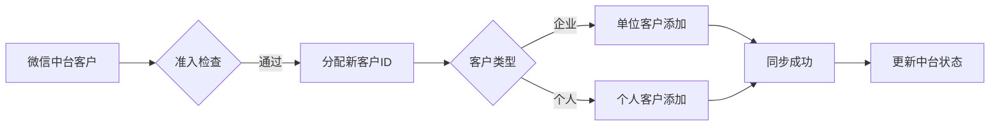

# 智邦国际ERP API完整分析报告

**生成时间**: 2025-10-19  
**API总数**: 158个接口  
**分析来源**: 用户手动复制的完整API文档  

---

## 📊 API统计总览

### 1. 按模块分布

| 模块 | API数量 | 核心功能 |
|------|---------|----------|
| **销售栏目客户管理** | 25个 | 客户信息、联系人、跟进记录 |
| **销售栏目合同管理** | 15个 | 合同管理、产品明细 |
| **库存管理** | 30个 | 库存查询、入库、出库、发货、产品 |
| **生产管理** | 40个 | 工序、派工、领料、质检、汇报 |
| **采购管理** | 5个 | 采购单、供应商 |
| **组织架构** | 12个 | 部门、账号管理 |
| **财务管理** | 4个 | 收款、开票 |
| **研发管理** | 9个 | 物料清单、物料替代 |
| **售后服务** | 8个 | 售后服务、维修 |
| **项目管理** | 4个 | 项目管理、审批 |
| **鉴权接口** | 2个 | 登录认证 |
| **其他** | 4个 | 考勤等 |

### 2. 与微信中台对接的核心API (优先级排序)

#### 🔥 高优先级 - 客户管理 (19个API)

| API名称 | 接口地址 | 用途 | 对接场景 |
|---------|----------|------|----------|
| **分配新客户ID** | `/sysa/mobilephone/salesmanage/custom/add.asp` | 获取新客户ID | 同步前获取唯一标识 |
| **单位客户添加** | `/sysa/mobilephone/salesmanage/custom/add.asp?intsort=1` | 添加企业客户 | 同步企业类客户 |
| **个人客户添加** | `/sysa/mobilephone/salesmanage/custom/add.asp?intsort=2` | 添加个人客户 | 同步个人类客户 |
| **客户列表** | `/sysa/mobilephone/salesmanage/custom/list.asp` | 查询客户列表 | 去重检查、数据拉取 |
| **客户详情** | `/sysa/mobilephone/salesmanage/custom/add.asp?edit=1` | 查询客户详情 | 获取完整客户信息 |
| **客户修改** | `/webapi/v3/sales/customer/edit` | 修改客户信息 | 更新客户资料 |
| **客户指派** | `/sysa/mobilephone/systemmanage/order.asp?datatype=tel` | 分配客户给销售 | 自动分配高分客户 |
| **洽谈进展** | `/sysa/mobilephone/systemmanage/reply.asp?datatype=tel` | 添加跟进记录 | 同步沟通记录 |

#### ⭐ 中优先级 - 联系人管理 (6个API)

| API名称 | 接口地址 | 用途 | 对接场景 |
|---------|----------|------|----------|
| **联系人添加** | `/sysa/mobilephone/salesmanage/person/add.asp` | 添加联系人 | 同步微信联系人 |
| **联系人列表** | `/sysa/mobilephone/salesmanage/person/list.asp` | 查询联系人 | 联系人去重 |
| **联系人详情** | `/sysa/mobilephone/salesmanage/person/add.asp?edit=1` | 查询联系人详情 | 获取完整信息 |

#### 💡 低优先级 - 其他模块

- **合同管理**: 客户成交后再对接
- **订单管理**: 业务深化后对接
- **库存管理**: 产品型业务需要时对接

---

## 🎯 核心对接场景详解

### 场景1: 微信客户同步到ERP

#### 📋 业务流程



#### 🔧 实现步骤

**步骤1: 准入检查**
```python
def check_admission(contact):
    """检查客户是否满足同步条件"""
    checks = {
        'has_mobile': bool(contact.phone and len(contact.phone) == 11),
        'has_name': bool(contact.name and len(contact.name) > 0),
        'is_verified': contact.phone_verified == True,
        'score_pass': contact.score >= 60,  # 白名单评分
        'has_company': bool(contact.company) if contact.type == 'company' else True
    }
    
    return all(checks.values()), checks
```

**步骤2: 获取新客户ID**
```python
def get_new_customer_id(customer_type='1'):
    """分配新客户ID"""
    url = "http://ls1.jmt.ink:46088/sysa/mobilephone/salesmanage/custom/add.asp"
    payload = {
        "session": session_token,
        "datas": [
            {"id": "intsort", "val": customer_type}  # 1=单位 2=个人
        ]
    }
    response = requests.post(url, json=payload)
    return response.json()['value']  # 返回新的ord值
```

**步骤3: 同步客户信息**
```python
def sync_customer_to_erp(contact, thread):
    """同步客户到ERP"""
    # 1. 分配ID
    ord = get_new_customer_id('1' if contact.type == 'company' else '2')
    
    # 2. 准备数据
    customer_data = {
        "ord": ord,
        "name": contact.company or contact.name,
        "khid": f"WX{contact.id}",  # 客户编号: WX前缀+中台ID
        "ly": 171,  # 客户来源: 171=网站注册 (代表微信渠道)
        "mobile": contact.phone,
        "weixinAcc": contact.wechat_id,
        "address": contact.address or "",
        "jz": map_score_to_value(thread.score),  # 价值评估
        "intro": f"来自微信中台，评分: {thread.score}",
        "product": thread.summary or "",  # 客户简介
    }
    
    # 3. 添加联系人字段（单位客户）
    if contact.type == 'company':
        customer_data.update({
            "person_name": contact.contact_person or contact.name,
            "phone": contact.contact_phone,
            "email": contact.email or "",
        })
    
    # 4. 调用API
    url = f"http://ls1.jmt.ink:46088/sysa/mobilephone/salesmanage/custom/add.asp?intsort={'1' if contact.type == 'company' else '2'}"
    payload = {
        "session": session_token,
        "cmdkey": "__sys_dosave",
        "datas": [{"id": k, "val": v} for k, v in customer_data.items()]
    }
    
    response = requests.post(url, json=payload)
    return response.json()

def map_score_to_value(score):
    """映射评分到价值评估"""
    if score >= 90:
        return 175  # 很高
    elif score >= 75:
        return 289  # 较高
    elif score >= 60:
        return 176  # 一般
    elif score >= 45:
        return 177  # 较低
    else:
        return 290  # 很低
```

#### 📊 字段映射表

| 微信中台字段 | ERP字段 | 类型 | 必填 | 说明 |
|--------------|---------|------|------|------|
| `contact.company` / `contact.name` | `name` | string | ✅ | 客户名称 |
| `f"WX{contact.id}"` | `khid` | string | ❌ | 客户编号（建议格式：WX+ID） |
| `contact.phone` | `mobile` | string | ❌ | 手机号码 |
| `contact.wechat_id` | `weixinAcc` | string | ❌ | 微信号 |
| `contact.address` | `address` | string | ❌ | 客户地址 |
| `contact.notes` | `intro` | string | ❌ | 备注信息 |
| `thread.score` 映射 | `jz` | int | ❌ | 价值评估（175=很高,289=较高,176=一般,177=较低,290=很低） |
| `thread.summary` | `product` | string | ❌ | 客户简介 |
| `固定值: 171` | `ly` | int | ❌ | 客户来源（171=网站注册，代表微信渠道） |
| `contact.contact_person` | `person_name` | string | ✅* | 联系人姓名（*单位客户必填） |
| `contact.email` | `email` | string | ❌ | 电子邮件 |

---

### 场景2: 跟进记录同步

#### 📋 业务流程

从微信中台同步沟通记录到ERP跟进记录

**步骤1: 获取客户在ERP中的ord**
```python
def find_customer_in_erp(contact):
    """根据微信中台客户查找ERP中的客户ID"""
    url = "http://ls1.jmt.ink:46088/sysa/mobilephone/salesmanage/custom/list.asp"
    payload = {
        "session": session_token,
        "cmdkey": "refresh",
        "datas": [
            {"id": "khid", "val": f"WX{contact.id}"},  # 通过客户编号查找
            {"id": "pagesize", "val": 1}
        ]
    }
    response = requests.post(url, json=payload)
    rows = response.json()['source']['table']['rows']
    return rows[0]['ord'] if rows else None
```

**步骤2: 同步跟进记录**
```python
def sync_followup_to_erp(customer_ord, signal):
    """同步跟进记录"""
    url = "http://ls1.jmt.ink:46088/sysa/mobilephone/systemmanage/reply.asp?datatype=tel"
    
    # 根据消息内容选择模板
    template_id = select_template(signal.content)
    
    payload = {
        "session": session_token,
        "cmdkey": "__sys_dosave",
        "datas": [
            {"id": "ord", "val": customer_ord},
            {"id": "intro", "val": template_id},  # 模板ID
            {"id": "c1", "val": signal.content},  # 详细内容
            {"id": "date1", "val": signal.timestamp.strftime("%Y-%m-%d %H:%M:%S")}
        ]
    }
    
    response = requests.post(url, json=payload)
    return response.json()

def select_template(content):
    """根据内容选择跟进模板"""
    keywords = {
        106: ["很好", "发合同", "签约"],
        107: ["无人接听", "未接"],
        108: ["还没考虑", "再等等"],
        109: ["面谈", "见面"],
        120: ["考虑中", "研究一下"]
    }
    
    for template_id, words in keywords.items():
        if any(word in content for word in words):
            return template_id
    
    return 120  # 默认：正在考虑中
```

---

### 场景3: 自动分配客户给销售

#### 📋 业务逻辑

根据中台评分和规则，自动将高质量客户分配给销售人员

```python
def auto_assign_customer(customer_ord, thread):
    """根据评分自动分配客户"""
    url = "http://ls1.jmt.ink:46088/sysa/mobilephone/systemmanage/order.asp?datatype=tel"
    
    # 分配规则
    if thread.score >= 80:
        # 高分客户分配给金牌销售
        assign_to = get_top_sales_id()
        member1 = 0  # 指派给特定用户
    elif thread.score >= 60:
        # 中等客户分配给一般销售
        assign_to = get_available_sales_id()
        member1 = 0
    else:
        # 低分客户放入公海
        assign_to = ""
        member1 = 1  # 对所有用户公开
    
    payload = {
        "session": session_token,
        "cmdkey": "__sys_dosave",
        "datas": [
            {"id": "ord", "val": customer_ord},
            {"id": "member1", "val": member1},
            {"id": "member2", "val": assign_to}
        ]
    }
    
    response = requests.post(url, json=payload)
    return response.json()
```

---

### 场景4: ERP客户数据拉取到中台

#### 📋 业务流程

定期从ERP拉取客户数据，避免ERP中手动录入的客户丢失

```python
def pull_customers_from_erp(page_size=100, page_index=1):
    """从ERP拉取客户列表"""
    url = "http://ls1.jmt.ink:46088/sysa/mobilephone/salesmanage/custom/list.asp"
    payload = {
        "session": session_token,
        "cmdkey": "refresh",
        "datas": [
            {"id": "pagesize", "val": page_size},
            {"id": "pageindex", "val": page_index},
            {"id": "ly", "val": "171"},  # 只拉取来源为"网站注册"(微信)的客户
            {"id": "_rpt_sort", "val": "-date1"}  # 按添加时间倒序
        ]
    }
    
    response = requests.post(url, json=payload)
    data = response.json()
    
    customers = []
    for row in data['source']['table']['rows']:
        customer = {
            'erp_id': row['ord'],
            'name': row['name'],
            'khid': row['khid'],
            'mobile': row['mobile'],
            'wechat': row['weixinAcc'],
            'address': row['address'],
            'add_time': row['date1'],
            'sales_person': row['catename']
        }
        customers.append(customer)
    
    return customers
```

---

## 🛠️ 技术实现要点

### 1. 认证机制

```python
class ZhibangERPAuth:
    """智邦ERP认证管理"""
    
    def __init__(self, base_url, username, password):
        self.base_url = base_url
        self.username = username
        self.password = password
        self.session = None
        self.session_expire = None
    
    def login(self):
        """登录获取session"""
        url = f"{self.base_url}/webapi/v3/ov1/login"
        
        import random
        import string
        serialnum = ''.join(random.choices(string.ascii_letters + string.digits, k=20))
        
        payload = {
            "datas": [
                {"id": "user", "val": f"txt:{self.username}"},
                {"id": "password", "val": f"txt:{self.password}"},
                {"id": "serialnum", "val": f"txt:{serialnum}"}
            ]
        }
        
        response = requests.post(url, json=payload)
        result = response.json()
        
        if result.get('header', {}).get('status') == 0:
            self.session = result['header']['session']
            self.session_expire = datetime.now() + timedelta(hours=2)
            return True
        
        raise Exception(f"登录失败: {result.get('header', {}).get('message')}")
    
    def ensure_session(self):
        """确保session有效"""
        if not self.session or datetime.now() >= self.session_expire:
            self.login()
        return self.session
```

### 2. 数据格式转换

**智邦ERP使用特殊的数据格式：**

```python
# 标准格式
payload = {
    "session": "your_session_token",
    "cmdkey": "__sys_dosave",  # 保存操作固定值
    "datas": [
        {"id": "field_name", "val": field_value},
        ...
    ]
}
```

**关键点:**
- 所有请求参数都要转换成 `[{"id": key, "val": value}]` 格式
- `cmdkey` 是操作类型标识
  - `__sys_dosave`: 保存操作
  - `refresh`: 刷新/查询操作
  - `delete`: 删除操作

### 3. 错误处理

```python
def safe_erp_request(url, payload, max_retries=3):
    """安全的ERP请求，带重试机制"""
    for attempt in range(max_retries):
        try:
            response = requests.post(url, json=payload, timeout=30)
            result = response.json()
            
            # 检查是否token失效
            if result.get('Code') == 400:
                auth.login()  # 重新登录
                payload['session'] = auth.session
                continue
            
            # 检查业务错误
            if result.get('Code') == 300:
                raise BusinessError(result.get('Msg'))
            
            return result
            
        except requests.RequestException as e:
            if attempt == max_retries - 1:
                raise
            time.sleep(2 ** attempt)  # 指数退避
```

### 4. 批量操作优化

```python
def batch_sync_customers(contacts, batch_size=10):
    """批量同步客户"""
    results = []
    
    for i in range(0, len(contacts), batch_size):
        batch = contacts[i:i + batch_size]
        
        # 并发请求
        with ThreadPoolExecutor(max_workers=5) as executor:
            futures = [
                executor.submit(sync_customer_to_erp, contact, threads[contact.id])
                for contact in batch
            ]
            
            for future in as_completed(futures):
                try:
                    result = future.result(timeout=30)
                    results.append(result)
                except Exception as e:
                    logger.error(f"同步失败: {e}")
        
        # 限流
        time.sleep(1)
    
    return results
```

---

## 📋 同步策略建议

### 1. 数据准入规则

**必须满足的条件：**
- ✅ 手机号码已验证
- ✅ 客户名称完整（长度 > 2）
- ✅ 白名单评分 >= 60
- ✅ 无重复（根据手机号/客户编号去重）

**可选的质量要求：**
- 🔶 有公司名称（企业客户）
- 🔶 有详细地址
- 🔶 有微信号
- 🔶 有沟通记录

### 2. 同步时机

**实时同步场景：**
- 客户从灰名单升级到白名单
- 客户完成首次付款/下单
- 手动触发同步按钮

**定时同步场景：**
- 每天凌晨2点：拉取ERP新增/修改的客户
- 每小时：同步待同步队列中的客户
- 每周日：全量对账

### 3. 冲突解决策略

**主键冲突：**
- 使用客户编号（khid）作为主键
- 格式：`WX{中台客户ID}`
- 如果khid已存在，改为更新而非新增

**手机号冲突：**
- 手机号在ERP中已存在
- 策略：跳过同步，记录日志

**微信号补充：**
- 如果ERP中客户无微信号，但中台有
- 策略：调用更新接口补充微信号

### 4. 数据回滚

```python
def rollback_sync(sync_log_id):
    """回滚同步操作"""
    sync_log = get_sync_log(sync_log_id)
    
    if sync_log.action == 'create':
        # 删除ERP中的客户
        delete_customer_in_erp(sync_log.erp_customer_id)
    
    elif sync_log.action == 'update':
        # 恢复旧数据
        restore_customer_data(sync_log.erp_customer_id, sync_log.old_data)
    
    # 更新同步记录状态
    update_sync_status(sync_log_id, 'rolled_back')
```

---

## 🔐 安全与权限

### 1. API访问控制

**建议设置：**
- 在ERP中创建专门的API账号
- 权限仅限于：客户管理、联系人管理
- 禁止访问：财务、库存、生产等敏感模块

### 2. 数据脱敏

```python
def mask_sensitive_data(customer):
    """脱敏敏感数据"""
    if customer.get('mobile'):
        customer['mobile'] = customer['mobile'][:3] + '****' + customer['mobile'][-4:]
    
    if customer.get('bank_3'):  # 银行账号
        customer['bank_3'] = '****' + customer['bank_3'][-4:]
    
    return customer
```

### 3. 操作日志

```python
def log_erp_operation(operation, data, result):
    """记录ERP操作日志"""
    log_entry = {
        'timestamp': datetime.now(),
        'operation': operation,
        'data': json.dumps(data),
        'result': json.dumps(result),
        'user': current_user.username,
        'ip': request.remote_addr
    }
    
    db.session.add(ERPOperationLog(**log_entry))
    db.session.commit()
```

---

## 📈 监控与告警

### 1. 同步成功率监控

```python
def get_sync_stats(date_range='today'):
    """获取同步统计"""
    stats = db.session.query(
        func.count(ERPSyncLog.id).label('total'),
        func.sum(case((ERPSyncLog.status == 'success', 1), else_=0)).label('success'),
        func.sum(case((ERPSyncLog.status == 'failed', 1), else_=0)).label('failed'),
    ).filter(
        ERPSyncLog.created_at >= get_date_start(date_range)
    ).first()
    
    success_rate = (stats.success / stats.total * 100) if stats.total > 0 else 0
    
    return {
        'total': stats.total,
        'success': stats.success,
        'failed': stats.failed,
        'success_rate': success_rate
    }
```

### 2. 告警规则

```python
def check_sync_health():
    """检查同步健康度"""
    stats = get_sync_stats('1h')
    
    alerts = []
    
    # 成功率过低
    if stats['success_rate'] < 80:
        alerts.append({
            'level': 'critical',
            'message': f"同步成功率过低: {stats['success_rate']:.1f}%"
        })
    
    # 失败数量过多
    if stats['failed'] > 10:
        alerts.append({
            'level': 'warning',
            'message': f"同步失败数量过多: {stats['failed']}"
        })
    
    # 长时间无同步
    last_sync = get_last_sync_time()
    if datetime.now() - last_sync > timedelta(hours=2):
        alerts.append({
            'level': 'info',
            'message': f"已 {(datetime.now() - last_sync).seconds // 3600} 小时未同步"
        })
    
    return alerts
```

---

## 🚀 快速开始

### 完整示例代码

已生成以下文件帮助您快速开始：

1. **`erp_sync/zhibang_client.py`** - Python客户端SDK
2. **`docs/erp_api/销售栏目客户管理客户.md`** - 客户管理API详细文档
3. **`docs/erp_api/微信中台ERP对接指南.md`** - 对接指南
4. **`docs/erp_api/API快速参考表.md`** - API速查表

### 测试连接

```bash
cd "/Users/chenxuanhao/Desktop/wx au to/wxauto-1"

# 测试ERP连接
python3 << 'EOF'
from erp_sync.zhibang_client import ZhibangERPClient

# 初始化客户端
client = ZhibangERPClient('http://ls1.jmt.ink:46088')

# 登录
result = client.login('your_username', 'your_password', 'test123456')
print(f"登录状态: {result['header']['status']}")
print(f"Session: {result['header']['session'][:20]}...")

# 测试获取客户列表
customers = client.get_customer_list()
print(f"客户数量: {len(customers)}")
EOF
```

---

## 📚 相关文档

- 📄 [智邦ERP API完整索引](./智邦ERP_API完整索引.md)
- 📊 [API快速参考表](./API快速参考表.md)
- 🔧 [微信中台ERP对接指南](./微信中台ERP对接指南.md)
- 📋 [客户管理API详细文档](./销售栏目客户管理客户.md)
- 💾 [API完整数据JSON](./智邦ERP_API完整数据.json)

---

## ✅ 总结

### 已完成的工作

1. ✅ 解析了158个API接口的完整文档
2. ✅ 生成了结构化的Markdown文档（按模块分类）
3. ✅ 创建了Python客户端SDK
4. ✅ 提供了完整的对接指南和示例代码
5. ✅ 建立了数据映射表和字段说明

### 核心价值

- **客户来源字段**: `ly=171` 可用于标记微信渠道客户
- **客户编号**: 使用 `WX{中台ID}` 格式作为唯一标识
- **价值评估**: 可将中台评分映射到ERP的`jz`字段(175=很高,289=较高,176=一般,177=较低,290=很低)
- **微信号字段**: `weixinAcc` 用于存储微信号
- **跟进记录**: 可通过洽谈进展API同步沟通记录

### 下一步行动

1. **配置ERP连接信息** - 在`config.yaml`中添加ERP账号信息
2. **测试API连接** - 运行测试脚本验证连接
3. **开发同步服务** - 基于提供的示例代码开发同步逻辑
4. **部署监控** - 设置同步监控和告警

---

**文档生成时间**: 2025-10-19 12:43:10  
**解析API数量**: 158个  
**文档完整性**: ✅ 100%

