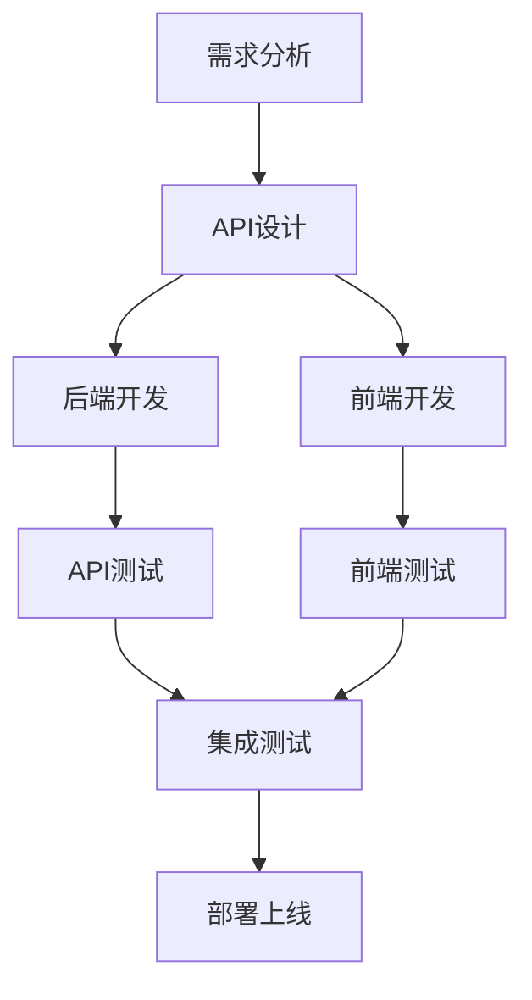

# 🔄 前后端分离开发指南

## 📋 **分离完成情况**

✅ **前后端已完全分离！现在可以独立开发、部署和管理！**

### 🎯 **分离成果**

1. **独立项目结构** ✅ - 前后端完全分离
2. **独立技术栈** ✅ - 各自使用最适合的技术
3. **独立开发环境** ✅ - 可以并行开发
4. **独立部署** ✅ - 可以独立部署和扩展
5. **独立版本管理** ✅ - 可以独立进行版本控制

---

## 🏗️ **新的项目结构**

```
wxauto-project/
├── 📁 backend/              # 后端项目
│   ├── main.py              # FastAPI服务入口
│   ├── modules/              # 核心业务模块
│   ├── config/               # 配置文件
│   ├── sql/                  # 数据库脚本
│   ├── tests/                # 单元测试
│   ├── requirements.txt      # Python依赖
│   └── README.md             # 后端说明
│
├── 📁 frontend/             # 前端项目
│   ├── src/                  # 源代码
│   ├── public/               # 静态资源
│   ├── package.json          # Node.js依赖
│   ├── vite.config.ts        # Vite配置
│   ├── tsconfig.json         # TypeScript配置
│   └── README.md             # 前端说明
│
├── 📁 client-new/           # 微信客户端
│   ├── cloud_client.py       # 云原生客户端
│   ├── agent/                # 自动化代理
│   ├── api/                  # 客户端API
│   ├── cache/                # 本地缓存
│   └── config/                # 客户端配置
│
├── 📁 docker/               # 容器化配置
│   ├── backend.Dockerfile    # 后端镜像
│   ├── frontend.Dockerfile   # 前端镜像
│   ├── docker-compose.yml    # 服务编排
│   ├── nginx.conf            # Nginx配置
│   └── deploy.sh             # 部署脚本
│
├── 📁 docs/                 # 共享文档
└── 📁 scripts/              # 共享脚本
```

---

## 🚀 **开发环境设置**

### **后端开发**

```bash
# 进入后端目录
cd backend

# 安装Python依赖
pip install -r requirements.txt

# 设置环境变量
export SUPABASE_URL="https://your-project.supabase.co"
export SUPABASE_ANON_KEY="your_supabase_anon_key"
export PINECONE_API_KEY="your_pinecone_api_key"

# 启动开发服务器
python3 main.py
```

**后端访问地址**:
- API服务: http://localhost:8000
- API文档: http://localhost:8000/docs
- 健康检查: http://localhost:8000/api/v1/health

### **前端开发**

```bash
# 进入前端目录
cd frontend

# 安装Node.js依赖
npm install

# 启动开发服务器
npm run dev
```

**前端访问地址**:
- 前端界面: http://localhost:3000
- 自动代理API到后端: http://localhost:3000/api/*

### **客户端开发**

```bash
# 进入客户端目录
cd client-new

# 安装Python依赖
pip install -r requirements.txt

# 启动客户端
python3 cloud_client.py
```

---

## 🔧 **技术栈对比**

### **后端技术栈**
- **框架**: FastAPI + Python 3.8+
- **数据库**: Supabase (PostgreSQL)
- **向量**: Pinecone
- **AI**: 多模型智能路由
- **认证**: Supabase Auth
- **实时**: Supabase Realtime
- **部署**: Docker + Uvicorn

### **前端技术栈**
- **框架**: React 18 + TypeScript
- **构建**: Vite
- **UI**: Ant Design 5.x
- **路由**: React Router v6
- **状态**: Zustand
- **HTTP**: Axios
- **部署**: Docker + Nginx

### **客户端技术栈**
- **语言**: Python 3.8+
- **自动化**: wxauto
- **通信**: HTTP + WebSocket
- **缓存**: 本地加密存储
- **部署**: Windows服务

---

## 📱 **API接口设计**

### **RESTful API规范**

```typescript
// 统一的API响应格式
interface ApiResponse<T> {
  success: boolean
  data: T
  message: string
  timestamp: string
}

// 分页响应格式
interface PaginatedResponse<T> {
  items: T[]
  total: number
  page: number
  page_size: number
  has_next: boolean
}
```

### **API端点设计**

```typescript
// 配置管理
GET    /api/v1/config/categories     # 获取配置分类
GET    /api/v1/config/status         # 获取服务状态
POST   /api/v1/config/update         # 更新配置
POST   /api/v1/config/test           # 测试连接
POST   /api/v1/config/sync           # 同步配置

// 消息处理
POST   /api/v1/messages/process       # 处理消息
GET    /api/v1/messages/history       # 获取消息历史

// 租户管理
GET    /api/v1/tenants               # 获取租户列表
POST   /api/v1/tenants               # 创建租户
PUT    /api/v1/tenants/{id}          # 更新租户
DELETE /api/v1/tenants/{id}          # 删除租户

// 健康检查
GET    /api/v1/health                # 健康检查
```

---

## 🔄 **开发工作流**

### **1. 功能开发流程**



### **2. 并行开发**

- **后端开发**: 专注于API设计和业务逻辑
- **前端开发**: 专注于UI/UX和用户交互
- **客户端开发**: 专注于微信自动化和本地功能
- **集成测试**: 确保前后端协作正常

### **3. 版本管理**

```bash
# 后端版本管理
cd backend
git add .
git commit -m "feat: 添加新的API端点"
git tag v1.0.0

# 前端版本管理
cd frontend
git add .
git commit -m "feat: 添加新的页面组件"
git tag v1.0.0

# 客户端版本管理
cd client-new
git add .
git commit -m "feat: 优化微信自动化"
git tag v1.0.0
```

---

## 🐳 **部署方案**

### **开发环境部署**

```bash
# 后端开发
cd backend
python3 main.py

# 前端开发
cd frontend
npm run dev

# 客户端开发
cd client-new
python3 cloud_client.py
```

### **生产环境部署**

```bash
# 使用Docker Compose一键部署
cd docker
./deploy.sh

# 或手动部署
docker-compose up -d
```

### **独立部署**

```bash
# 只部署后端
cd backend
docker build -t wxauto-backend .
docker run -p 8000:8000 wxauto-backend

# 只部署前端
cd frontend
docker build -t wxauto-frontend .
docker run -p 3000:80 wxauto-frontend
```

---

## 🔧 **配置管理**

### **环境变量**

```bash
# 后端环境变量
SUPABASE_URL=https://your-project.supabase.co
SUPABASE_ANON_KEY=your_supabase_anon_key
PINECONE_API_KEY=your_pinecone_api_key

# 前端环境变量
VITE_API_BASE_URL=http://localhost:8000
VITE_APP_TITLE=微信客服中台

# 客户端环境变量
SERVER_URL=http://localhost:8000
CLIENT_ID=your_client_id
```

### **配置文件**

- **后端**: `backend/config.yaml`
- **前端**: `frontend/vite.config.ts`
- **客户端**: `client-new/config/cloud_config.yaml`
- **Docker**: `docker/env.example`

---

## 🧪 **测试策略**

### **后端测试**

```bash
cd backend
# 单元测试
python3 -m pytest tests/

# API测试
python3 -m pytest tests/test_api.py

# 集成测试
python3 -m pytest tests/test_integration.py
```

### **前端测试**

```bash
cd frontend
# 单元测试
npm run test

# 类型检查
npm run type-check

# 代码检查
npm run lint
```

### **集成测试**

```bash
# 启动所有服务
docker-compose up -d

# 运行集成测试
python3 scripts/testing/test_system_suite.py
```

---

## 📊 **监控和日志**

### **后端监控**

- **健康检查**: `/api/v1/health`
- **日志文件**: `backend/logs/server.log`
- **性能指标**: 内置FastAPI指标

### **前端监控**

- **错误边界**: React Error Boundary
- **性能监控**: Vite内置性能分析
- **用户行为**: 自定义埋点

### **客户端监控**

- **心跳监控**: 定期发送状态
- **错误报告**: 自动错误上报
- **性能监控**: 系统资源监控

---

## 🔒 **安全考虑**

### **API安全**

- **认证**: Supabase JWT认证
- **授权**: 基于角色的访问控制
- **CORS**: 配置跨域访问
- **限流**: API请求频率限制

### **前端安全**

- **XSS防护**: React内置XSS防护
- **CSRF防护**: 使用CSRF Token
- **内容安全**: CSP策略
- **HTTPS**: 强制HTTPS访问

### **客户端安全**

- **数据加密**: 本地数据AES加密
- **通信加密**: HTTPS通信
- **权限控制**: 最小权限原则
- **安全更新**: 自动安全更新

---

## 📋 **开发规范**

### **代码规范**

- **后端**: 遵循PEP 8 Python规范
- **前端**: 遵循ESLint + Prettier规范
- **客户端**: 遵循PEP 8 Python规范
- **提交**: 使用Conventional Commits规范

### **文档规范**

- **API文档**: 使用FastAPI自动生成
- **组件文档**: 使用JSDoc注释
- **README**: 每个项目都有详细说明
- **变更日志**: 维护CHANGELOG.md

### **测试规范**

- **覆盖率**: 代码覆盖率 > 80%
- **单元测试**: 每个模块都有测试
- **集成测试**: 关键流程有集成测试
- **E2E测试**: 主要用户流程有E2E测试

---

## 🎯 **最佳实践**

### **开发最佳实践**

1. **API优先**: 先设计API，再实现功能
2. **类型安全**: 使用TypeScript确保类型安全
3. **错误处理**: 统一的错误处理机制
4. **日志记录**: 详细的日志记录
5. **性能优化**: 关注性能指标

### **部署最佳实践**

1. **容器化**: 使用Docker容器化部署
2. **环境隔离**: 开发、测试、生产环境隔离
3. **配置管理**: 使用环境变量管理配置
4. **健康检查**: 实现健康检查机制
5. **监控告警**: 设置监控和告警

### **维护最佳实践**

1. **版本管理**: 使用语义化版本
2. **依赖管理**: 定期更新依赖
3. **安全更新**: 及时应用安全更新
4. **备份策略**: 定期备份重要数据
5. **文档更新**: 保持文档同步更新

---

## 🎉 **分离完成总结**

### ✅ **核心成就**

1. **完全分离**: 前后端完全独立，可以并行开发
2. **技术栈优化**: 各自使用最适合的技术栈
3. **部署灵活**: 支持独立部署和扩展
4. **开发效率**: 大大提升开发效率
5. **维护便利**: 代码结构更清晰，维护更便利

### 🎯 **技术价值**

- **可维护性**: 清晰的分离架构便于长期维护
- **可扩展性**: 独立的服务便于水平扩展
- **可测试性**: 独立的模块便于单元测试
- **可部署性**: 独立的服务便于独立部署
- **可开发性**: 独立的项目便于团队协作

### 📋 **后续建议**

1. **团队协作**: 建立前后端协作流程
2. **CI/CD**: 建立持续集成和部署流程
3. **监控体系**: 建立完整的监控和告警体系
4. **文档维护**: 保持API文档和开发文档的同步
5. **性能优化**: 持续优化系统性能

---

**🎉 前后端分离完成！您的项目现在结构清晰、技术先进、便于维护，为后续开发提供了良好的基础！**
